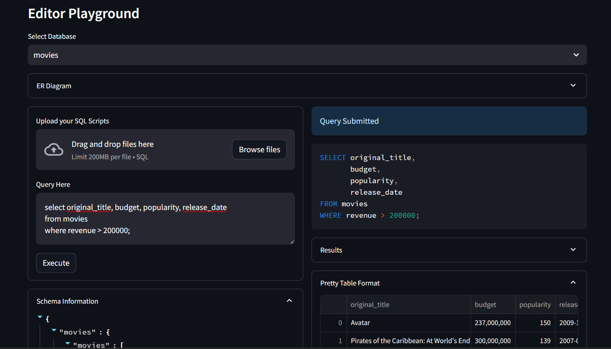
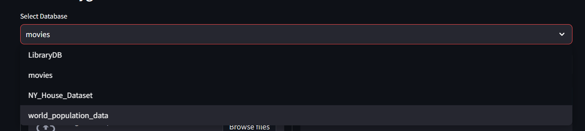
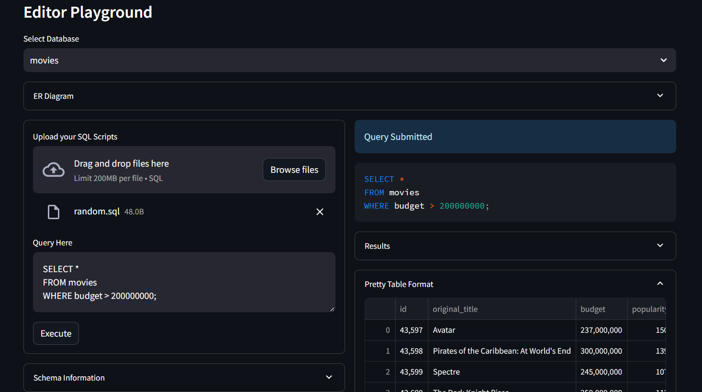
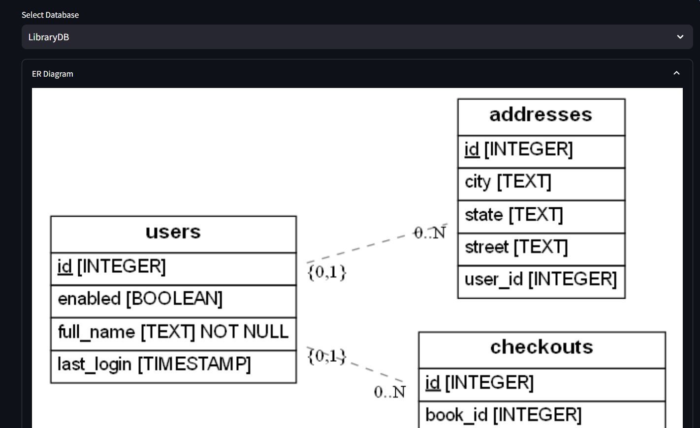
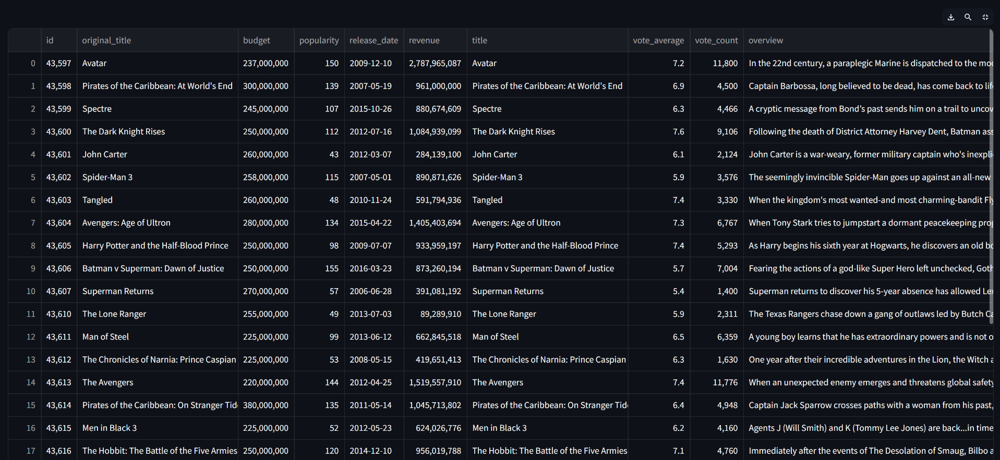
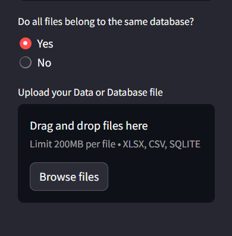

# SQLite Playground Documentation

Welcome to the SQLite Playground, a versatile platform for managing and 
exploring SQLite databases. This tool is designed to accommodate both novice users 
and seasoned database professionals.

checkout_live Website Here: 

## Comprehensive Features

### Advanced SQL Editor
Write and execute SQL queries efficiently with features like:
- Syntax Highlighting
- Error Detection

### Database Management
Easily manage your SQLite databases:
- Create, delete, and modify databases using queries
- Manage database schemas to which you want to work with using a dropdown list.

### SQL Script Upload and Execution
Automate tasks with batch processing:
- Upload and execute `.sql` scripts
- Convenient for repetitive database operations

### Schema Visualization
Understand and optimize your database structure:
- Visualize database schemas
- Explore table relationships

### Data Table Visualization
View query results in a user-friendly format:
- Enhanced data readability
- Table format for easier analysis

### File Uploader
Seamlessly integrate data:
- Upload `.csv`, `.xls`, `.xlsx`, or `.sqlite` files
- Create and populate databases from various file formats

## Developer Information
For inquiries or support, contact Venkatesh Tantravahi at [vtantravahi@gmail.com](mailto:vtantravahi@gmail.com).

## Feedback
We appreciate your feedback! Share your thoughts and suggestions.

---

SQLite Playground - Enhance your data management and SQL skills.
